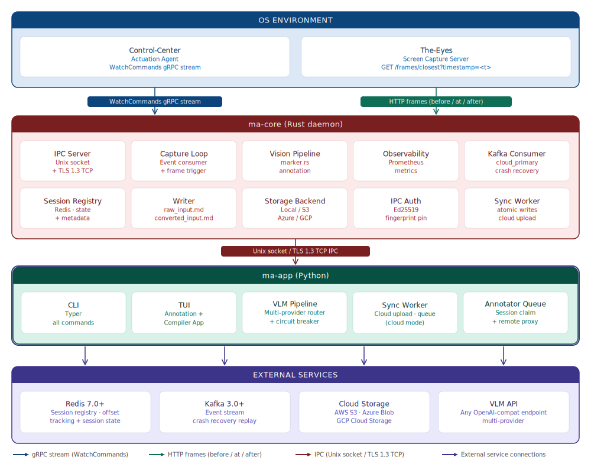
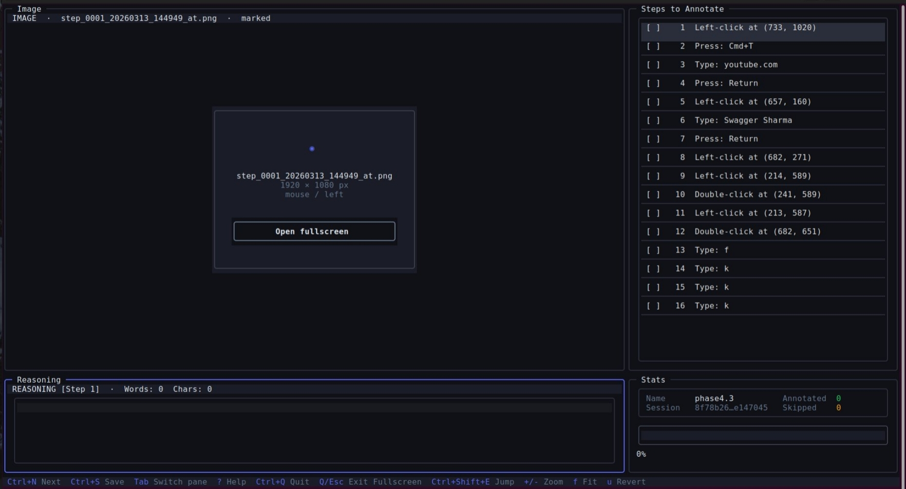
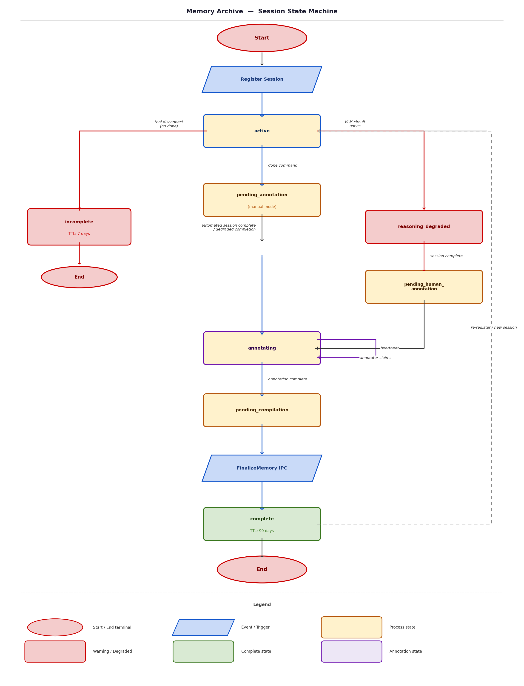

# Memory Archive

[](LICENSE)
[](https://github.com/nullvoider07/memory-archive/releases)
[](https://www.rust-lang.org/)
[](https://www.python.org/)
[](#platform-compatibility)

**Version:** 0.12.0  
**Last Updated:** July 2026  
**Developer:** Kartik (NullVoider)

> **✨ What's new in 0.12.0** — session lifecycle and capture-fidelity improvements:
> - **`memory-archive session delete`.** A first-class command to purge a session from everywhere: the Redis record plus every status/`by_os`/`by_mode` index set and its claim, all stored files (cloud objects and the local memory directory, including any `(incomplete)` sibling). Deleting a stale ID whose Redis record has already expired still sweeps orphaned index/claim entries and leftover storage. Active/annotating sessions require `--force`.
> - **Cursor-move frames.** `mouse/move` steps now capture before/at/after screenshots with the cursor marked at the destination, so "move cursor to X" steps carry visual context instead of being frameless. Applies to sessions captured on 0.12.0 and later.
> - **Annotation TUI display fix.** The image pane no longer shows an alarming `✗ Image not found` for steps that are frameless by design — it reads `No screenshot for this action`. Navigating from a frameless step to an image-bearing one no longer leaves a stale "No image available" label on the Open button, and the fullscreen viewer is now enabled on Windows.

> **📖 Documentation in progress** — Extended documentation covering in-depth deployment guides, architecture deep-dives, and operational runbooks for research teams, AI labs, and enterprise users is currently being written and will be published separately. This README serves as the primary reference in the meantime.
>
> Additionally, a research document covering the memory-grounded CUA training paradigm enabled by Memory Archive — including pre-training, SFT, post-training RL, and inference-time retrieval — has been published. Read it here: [Memory Archive: A Memory-Grounded Training Paradigm for Computer Use Agents](https://github.com/nullvoider07/memory-archive-paradigm).

Memory Archive is a production-grade, open-source Rust + Python monorepo that serves as the observational backbone for Computer Use Agent (CUA) training data collection. It monitors a running duo or trio of CUA tools — The-Eyes (screen capture) and Control-Center (actuation agent) — records every action with its full visual context (three screenshots per captured step), routes each step to either a human annotator or a Vision Language Model (VLM) for natural-language reasoning, and compiles the result into a structured `memory.md` file: a replayable, step-by-step document that a CUA can follow to autonomously repeat the task. Memory Archive is read-only by design: it never sends commands to the OS environment, never modifies the tools it monitors, and treats data integrity as its first priority — every write is atomic, every session is either complete or explicitly marked incomplete, and no state is ever batched or deferred.



---

## Table of Contents

1. [Overview](#1-overview)
2. [Key and Critical Features](#2-key-and-critical-features)
3. [Capabilities Summary](#3-capabilities-summary)
4. [Technical Specification](#4-technical-specification)
5. [Quick Start Guide](#5-quick-start-guide)
6. [Security Features](#6-security-features)
7. [Usage Modes](#7-usage-modes)
8. [CLI Command Reference](#8-cli-command-reference)
9. [TUI Usage and Features](#9-tui-usage-and-features)
10. [Configuration Reference](#10-configuration-reference)
11. [Session Management](#11-session-management)
12. [Metrics, Monitoring, and Observability](#12-metrics-monitoring-and-observability)
13. [Advanced Features](#13-advanced-features)

---

## 1. Overview

### What Is Memory Archive?

Memory Archive is a training data collection engine purpose-built for the CUA (Computer Use Agent) development and inference lifecycle. It sits alongside running CUA tools — specifically The-Eyes and Control-Center — and silently records every action event the actuation agent performs, paired with the precise visual state of the screen at the moment of that action. After capture, each recorded step is annotated with natural-language reasoning, either by a human reviewer using the built-in TUI or by a VLM in fully automated mode. The final output is `memory.md`: a structured, step-annotated document that a CUA can ingest and replay to autonomously repeat the captured task.

### Who Is It For?

| Audience | Use Case |
|---|---|
| **Individual developers** | Capture personal workflow memories on a single machine using local storage; annotate manually; build a private library of CUA-replayable task recordings |
| **Research teams** | Shared `ma-core` with cloud-primary storage; multiple annotators claiming sessions from a queue via the remote TUI; consistent provenance tracking across all recordings |
| **AI labs** | Fully automated mode with multi-provider VLM routing; per-session circuit breakers; signed pricing registry; Prometheus observability; Kafka-backed crash recovery; 100,000+ concurrent sessions per `ma-core` instance |
| **Enterprises** | Multi-tenant storage routing, per-annotator access control, audit trails, Ed25519-signed cost manifests, zero-credential annotator machines, TLS 1.3 IPC with fingerprint pinning |
| **CUA platforms** | Programmatic session registration via IPC; streaming `StepReadyForReasoning` push events; fully automated pipeline from capture to finalized `memory.md` without human intervention |

### What Memory Archive Is NOT

| It is NOT… | Why this matters |
|---|---|
| An actuation tool | It never sends commands to the OS environment; it only reads from Control-Center's stream |
| An orchestration layer | It does not schedule, plan, or coordinate CUA actions |
| A reasoning engine | It calls external VLM APIs; it does not perform its own inference |
| A storage backend | It writes to local disk or delegates to AWS S3, Azure, or GCP — it does not implement its own storage |
| An agent that lives inside the OS | It runs alongside the environment, not inside it |
| A file server | It proxies files to authorized remote annotators; it is not a general-purpose file server |
| A secrets manager | Cloud credentials and API keys are resolved from environment variables, never stored in `config.json` or transmitted over IPC |
| A certificate authority | It generates a self-signed CA and server cert for its own TLS IPC transport, not for general PKI use |
| A multi-cloud replication layer | It routes each session to one backend at registration time; it does not synchronize across providers |
| A pricing authority | Token cost rates come from an external, cryptographically signed manifest; Memory Archive does not determine pricing |

### Core Design Principles

| Principle | Description |
|---|---|
| **Read-only by design** | Memory Archive never issues commands to the OS environment, never modifies the tools it monitors, and has no write path into Control-Center or The-Eyes |
| **Data integrity above all** | Every write to disk or cloud is atomic (temp-file-then-rename); a crash at any point produces an explicitly flagged incomplete session, never a silently corrupted one |
| **Incremental persistence** | Every event, image, and annotation is persisted immediately and individually; nothing is batched, buffered, or flushed only at session end |
| **Capture-first, reasoning-async** | In automated mode, VLM API calls are dispatched asynchronously and never pause or delay the capture loop |
| **Scale-first** | A single `ma-core` instance is designed to handle 100,000+ concurrent active sessions without architectural changes |
| **Secrets never cross the wire** | Cloud credentials and VLM API keys never appear in IPC messages, config files, or log output; they are resolved from environment variables at runtime |
| **Zero-credential remote annotation** | Annotator machines hold no cloud credentials; all file reads and writes are proxied through `ma-core` over an authenticated, TLS-encrypted channel |
| **Per-session circuit breaker isolation** | Circuit breaker state lives in per-session objects; one session's VLM failure cannot degrade, open, or affect the circuit breaker of any other session |
| **Pricing truth is external and signed** | Token cost rates are sourced from a cryptographically signed manifest whose public key and URL are hardcoded in the binary; no user-entered or config-file rate is authoritative |
| **Storage backend is pinned at registration** | The storage backend for a session is selected and written to Redis when the session is registered; it is never re-evaluated mid-capture |
| **Single-instance enforcement** | `ma-core` writes a PID file on startup and refuses to start if a live process already holds that PID, preventing silent data corruption from duplicate writers |

---

## 2. Key and Critical Features

### Dual-Mode Operation (Manual and Automated)

Memory Archive operates in two distinct capture modes. In **manual mode**, a user performs a task live in the OS environment while Memory Archive records every non-position command event in real time. Annotation is done afterward using the built-in TUI. In **automated mode**, an orchestration layer registers sessions programmatically, and a VLM pipeline handles all reasoning asynchronously without pausing capture. Both modes produce identical output structures; the `source` field in `reasoning.jsonl` distinguishes human from model annotations.

### 100,000+ Concurrent Session Capacity

`ma-core` is a Rust async daemon built on Tokio. All session state — status, metadata, step counters, Kafka offsets — is stored in Redis, not in process memory. This means session count is bounded by Redis capacity, not by `ma-core` RAM. The capture loop, IPC server, cloud upload queue, VLM pipeline, and Prometheus endpoint all run concurrently without blocking each other. The architecture is validated for 100,000+ concurrent sessions per process.

### Atomic Crash-Safe Writes

Every file write — whether to local disk or cloud storage — goes through an atomic path: data is written to a uniquely named temporary file, then renamed into place. On any crash, the temp file is either absent (write never started) or present (renamed to an incomplete marker). No partial-write corruption of finalized files is possible. Sessions that disconnect without a `done` command are renamed to `{memory_name} (incomplete)/` and flagged in Redis with status `incomplete`.

### Three-Frame Visual Capture with Programmatic Mouse Annotation

For each captured step, Memory Archive fetches three frames from The-Eyes: a `before` frame (1000ms before the event), an `at` frame (exact event timestamp), and an `after` frame (1000ms after the event). For mouse events (click, double-click, right-click), the `at` frame is programmatically annotated in Rust by `marker`: a filled red circle (radius 6px, `#dc2626`) is drawn at the exact click coordinates, a directional arrow points from the circle edge toward the quadrant with the most available space, and a coordinate box displays the numeric `X:` and `Y:` values. The annotated frame is re-encoded to PNG. For keyboard events, the `at` frame is not annotated and is passed to the VLM or human annotator for contextual reasoning.

### Zero-Credential Remote Annotation

Remote annotators connect to `ma-core` over TLS 1.3 TCP using only an `annotator_id` and a 256-bit random key. They never hold cloud credentials. All file reads (`FetchFile`) and writes (`UploadFile`) are proxied through `ma-core`, which verifies the annotator's identity, checks write authority, and performs the actual cloud operation. Annotators receive only the files they are authorized to access for the sessions they have claimed.

### Per-Annotator Identity and Access Control

Each annotator is registered with a unique identity (`annotator_id`), a 256-bit random key (only the SHA-256 hash is stored in Redis), a list of allowed tenant ID prefixes (`allowed_tenant_ids`), and a maximum concurrent claim limit (`max_concurrent_claims`). Auth failure attempts are rate-limited per annotator. The annotation queue visible to an annotator is filtered by their `allowed_tenant_ids`. Deactivation preserves full audit history. Key rotation takes effect immediately, invalidating the old key.

### Multi-Cloud Storage Routing

A single `ma-core` instance can route different sessions to different storage backends — AWS S3, Azure Blob/ADLS/Files, GCP Cloud Storage, or local disk — based on configurable routing rules (tenant prefix, region tag, storage mode). The selected backend is pinned to the session at registration time and stored in Redis. Multiple named backends (e.g., `aws-us-east`, `azure-eu-west`, `gcp-asia`) can coexist in a single deployment. All backends support MD5 integrity verification on upload.

### Multi-Provider VLM Routing with Per-Session Circuit Breakers

`ma-app`'s `ModelRouter` applies one of three stateless routing policies — `pinned`, `fallback`, or `load_balance` — to select a VLM provider per request. Each session has its own `ReasoningPipeline` with an independent circuit breaker. A circuit opens after 5 consecutive non-retryable failures and enters a half-open trial after 60 seconds. When both primary and fallback circuits open, the session transitions to `reasoning_degraded` status, capture continues, and steps are marked `source: model_degraded`. On session completion, the session auto-enters the human annotation queue. At most two providers per session are permitted — one primary and one fallback — to preserve dataset clarity.

### Signed Pricing Registry

Token cost rates are sourced from an MA-hosted Ed25519-signed JSON manifest. The public key and manifest URL are both hardcoded in the binary and cannot be overridden by config or environment variables. The manifest is cached locally for 24 hours; signature verification is performed on every cache load. A failed signature check deletes the cache and triggers a fresh fetch, and fires an ERROR alert. Fallback tiers include the AWS Bedrock Pricing API and user-configured cost rates in `ProviderConfig`. Model aliases (e.g., `gpt-4o-2024-11-20` → `gpt-4o`) are resolved via the manifest's `aliases[]` array.

### Per-Session Server Address Management

Each session registration can specify its own `capture_server_addr` (The-Eyes) and `actuation_server_addr` (Control-Center), overriding the global config fallback. These per-session addresses are stored in Redis and used throughout the capture lifecycle. This enables a single `ma-core` instance to serve sessions spread across many different capture and actuation servers — a requirement at scale where The-Eyes and Control-Center may run on different hosts per OS environment.

### Full Prometheus Observability

`ma-core` exposes a Prometheus metrics endpoint (default port `9091`, bound to `127.0.0.1` by default; exposing it on a non-loopback address requires a Bearer token) with 25+ counters and gauges covering: active session count, steps captured per second, cloud upload queue depth and permanent failures, IPC connection counts and push queue depth, Kafka consumer lag, VLM request latency histograms (p50/p95/p99), per-provider error counts by type, circuit breaker state per session, pricing registry fetch status and manifest age, per-annotator active claims and auth failures, and storage routing decisions. Alert conditions are delivered via configurable webhook.

### TUI Annotation Interface

The built-in TUI (built on Textual) provides a two-pane interface: a virtual-scrolling step list on the left and an image preview on the right, with a multi-line reasoning editor, word counter, undo/redo, clipboard support, and autosave every 2.5 seconds. Steps are resumable — previously saved reasoning is loaded from `reasoning.jsonl` on open. The TUI is followed automatically by `CompilerApp`, a full-screen terminal text editor for producing and finalizing `memory.md`. In remote annotator mode, the TUI sends claim heartbeats every 5 minutes and prefetches the next step's images in the background.

### Install, Update, and Uninstall Tooling

Memory Archive ships with a one-line installer for Linux/macOS (`install.sh`) and Windows (`install.ps1`), covering both the Rust binaries and the Python wheel. Every download is verified against a published `SHA256SUMS` manifest before extraction, and archives are unpacked with path-traversal guards. The `memory-archive update` command downloads and checksum-verifies the latest platform archive and replaces binaries in place. The `memory-archive uninstall` command removes the binaries and CLI launcher and optionally purges all local state (`--purge`). All three paths handle version transitions cleanly without leaving orphaned files.

---

## 3. Capabilities Summary

### Complete Capability Index (by subsystem)

**Session lifecycle:**
- Register a new session (manual or automated mode) via IPC
- Start watching a session's command stream
- Signal session completion (`done`)
- Query full session status from Redis
- Automatic transition from `reasoning_degraded` → `pending_human_annotation` on session completion
- Startup sweep: mark sessions with stale heartbeats as `incomplete` on `ma-core` restart
- Reconcile sweep: re-queue orphaned `annotating` sessions on `ma-core` restart

**Capture:**
- Stream CommandEvent messages from Control-Center WatchCommands gRPC endpoint
- Consume CommandEvent messages from Kafka (cloud_primary mode)
- Drop position-only events silently (no file write, no step counter increment)
- Write `raw_input.md`, `converted_input.md`, `actuation_commands.json`, `cc_commands.json` atomically per step
- Mark failed commands with `[FAILED]` prefix in `raw_input.md`
- Detect tool silence beyond configurable timeout and trigger graceful disconnect
- Filter Control-Center heartbeat-only messages from the command stream
- Track Kafka partition and offset per session for crash recovery

**Image capture:**
- Fetch `before`, `at`, and `after` frames from The-Eyes per step
- Route fetch using `FetchDecision` based on action type and configurable timing offsets
- Skip image fetches for position events and failed commands
- Fetch `closing_state.webp` on session `done`
- Log skipped image fetches in `metadata.json` without blocking step record
- Annotate mouse `at` frames in Rust (marker.rs): filled circle, directional arrow, coordinate box
- Re-encode annotated frames to PNG
- Check The-Eyes liveness via configurable poll interval

**Storage:**
- Write to local disk with atomic temp-file-then-rename
- Upload to AWS S3 (multipart >5MB, MD5 + ETag integrity verification)
- Upload to Azure Blob Storage, ADLS Gen2, and Azure Files (auto-detection, MD5 integrity)
- Upload to GCP Cloud Storage (MD5 integrity)
- Route sessions to named storage backends via routing rules
- Pin storage backend per session in Redis at registration
- Retry uploads with exponential backoff (SyncWorker)
- Permanently fail uploads after max retries and fire an ERROR alert
- Track per-session upload state in `sync_log.json`
- Flush `metadata.json` to cloud every N steps (`metadata_flush_interval`)
- Proxy file reads and writes for remote annotators via IPC (zero cloud credentials on annotator machine)
- Download session files for annotation in local mode (`fetch_session_if_missing`)
- Download session files to temp dir for cloud_primary annotation (`RemoteFetcher`)

**Conversion:**
- Convert raw command strings to human-readable descriptions
- Normalize key names per OS (`humanize_key`)
- Produce OS-specific human-readable output for keyboard and mouse events

**Reasoning — manual/human:**
- Open TUI for step-by-step human annotation
- Load existing reasoning from `reasoning.jsonl` on TUI open (resumable)
- Write reasoning atomically to `reasoning.jsonl` via `ReasoningWriter`
- Send `UpdateAnnotationProgress` IPC notification per save
- Support step skipping (skipped steps logged in `reasoning.jsonl`)
- Send claim heartbeat every 5 minutes in remote annotator mode

**Reasoning — automated/VLM:**
- Receive `StepReadyForReasoning` push from `ma-core` per step
- Route to primary or fallback VLM per session routing policy
- Call any OpenAI-compatible API endpoint (`GenericApiModelBackend`)
- Call Proprietary VLM API (`InternalModelBackend`)
- Apply sliding-window rate limiting (requests/min + token budget/hour)
- Track per-session circuit breaker state (threshold, reset interval)
- Transition session to `reasoning_degraded` when circuit opens
- Return `ReasoningResult` to `ma-core` via IPC
- Send `automated` command to start VLM daemon per session

**Compilation:**
- Generate `memory.md` scaffold from `reasoning.jsonl` (`run_compile`)
- Open `CompilerApp` for full-screen terminal editing
- Finalize session (status → `complete`, Redis 90-day TTL, `FinalizeMemory` IPC) on editor save

**Remote annotation:**
- Register annotators via admin CLI or REST API
- Deactivate annotators (audit history preserved)
- Rotate annotator keys (immediate effect)
- List all annotators with status and claim counts
- Generate base64 connection profile strings for annotator onboarding
- Set up annotator config from profile string on annotator machine
- List annotation queue (filtered by `allowed_tenant_ids`)
- Claim specific or oldest available session
- Release session claim
- Auto-heartbeat claim TTL renewal
- Detect and handle claim expiry mid-annotation

**Observability:**
- Expose Prometheus metrics on configurable port with optional Bearer token auth
- Emit structured JSON logs (capture, IPC, storage, VLM subsystems)
- Deliver webhook alerts for all defined alert conditions
- Track pricing registry fetch status, manifest age, and signature verification result
- Track per-annotator active claims and auth failure rates
- Track storage routing decisions and backend errors

**Server management:**
- Start `ma-core` in foreground or daemon mode
- Stop `ma-core` via SIGTERM / taskkill
- Stream or tail `ma-core` logs
- Start `ma-kafka-producer` Kafka bridge for a session
- Generate and display TLS cert fingerprint
- Enforce single-instance via PID file

**Install/update/uninstall:**
- One-line install on Linux/macOS and Windows
- Check for updates without downloading
- In-place binary update
- Uninstall with optional full state purge

---

### Detailed Capability Descriptions

**Session Lifecycle Management.** Every Memory Archive recording begins with a session registration IPC call that creates a Redis hash for the session and initializes the memory directory structure on disk or cloud. The session moves through a well-defined state machine — `active` → `pending_annotation` → `annotating` → `pending_compilation` → `complete` — with defined exception paths for incomplete disconnects and VLM degradation. Redis Set indexes (`sessions:active`, `sessions:pending`, etc.) allow O(1) membership checks and fast queue operations. On `ma-core` startup, a startup sweep inspects all sessions with `active` or `annotating` status and marks those whose associated processes are no longer running as `incomplete` or re-queues them. A reconcile sweep re-queues any orphaned `annotating` sessions that have no live heartbeat. TTLs are enforced in Redis: `incomplete` sessions expire after 7 days, `complete` sessions after 90 days.

**Capture and Command Processing.** The capture loop (`run_watch_loop`) supports two event sources — direct gRPC streaming from Control-Center or Kafka consumption (cloud_primary mode). In gRPC mode, the `WatchStream` connects directly to the Control-Center WatchCommands endpoint. In Kafka mode, `StreamConsumer` subscribes to the `control-center-events` topic, consuming from the partition keyed to the session's `session_id`. Position-only events are silently dropped; heartbeat-only messages from Control-Center are filtered before any processing. For each non-position event, the capture loop writes four files atomically: `raw_input.md` (raw command string), `converted_input.md` (human-readable), `actuation_commands.json` (full CommandEvent JSON), and `cc_commands.json` (Control-Center replay format). The `convert` module normalizes key names per OS (`humanize_key`) and generates grammatically correct human-readable descriptions. Silence detection monitors the time since the last non-position event; if the configurable `silence_timeout_seconds` elapses without activity, the session is gracefully disconnected.

**Three-Frame Image Capture and Annotation.** For each step, `VisionPipeline` evaluates a `FetchDecision` — based on action type, event timestamp, and per-type timing offsets — and issues three HTTP requests to The-Eyes' `/frames/closest` endpoint. The `before` frame is fetched at `timestamp - 1000ms`, the `at` frame at the exact event timestamp (plus a press or type delay for keyboard events), and the `after` frame at `timestamp + 1000ms`. For mouse events, `marker.rs` annotates the `at` frame in Rust: a filled red circle is drawn at the click coordinates, a directional arrow is drawn from the circle edge toward the least-crowded screen quadrant, and a coordinate box is rendered with the numeric X/Y values. The annotated frame is re-encoded to PNG. Before/after frame fetch failures are logged in `metadata.json` under `skipped_image_fetches[]` but do not block the `at` frame or the step record. A `closing_state.webp` is fetched on the `done` command.

**Multi-Cloud Storage with Routing.** `StorageRouter` selects a named backend at session registration time by evaluating routing rules against session attributes (tenant prefix, region tag, mode). The backend name is stored in the Redis session hash and is never re-evaluated. Each named backend (`LocalBackend`, `S3Backend`, `AzureBackend`, `GcpBackend`) implements the `StorageBackend` trait and handles its own credential resolution, integrity verification, and retry logic. In local mode, `SyncWorker` runs as a background thread, dequeuing `FileWritten` events and uploading to cloud with exponential backoff. Permanent upload failures fire an ERROR webhook alert. Cloud session read-back for annotation (fetching a session from cloud to a temp dir) is handled by `RemoteFetcher` for remote annotators and `fetch_session_if_missing` for local annotation.

**VLM Reasoning Pipeline.** In automated mode, `ma-core` emits a `StepReadyForReasoning` IPC push event per step. `ma-app`'s `ReasoningPipeline` receives the push, applies the session's routing policy via `ModelRouter`, and dispatches the request to the selected `ModelBackend` — either `GenericApiModelBackend` (any OpenAI-compatible endpoint) or `InternalModelBackend` (Proprietary VLM). Rate limiting is applied via a sliding-window `RateLimiter` across both `requests_per_minute` and `token_budget_per_hour`. The per-session circuit breaker in `ReasoningPipeline` counts non-retryable failures; at the threshold, it opens, all subsequent requests for that session return `model_degraded`, and after `circuit_breaker_reset_seconds`, a single half-open trial request is sent. If the trial succeeds, the circuit closes. On `ReasoningResult` return, `ma-core` writes the reasoning to `reasoning.jsonl`, updates `metadata.json` token counts, and advances the session.

**Human Annotation TUI.** `AnnotationApp` is a Textual-based terminal application providing a two-pane interface: a virtual-scrolling `StepList` on the left (with step status icons and accordion expansion) and an image preview pane on the right. The `ReasoningEditor` widget supports multi-line input, word counting, undo/redo with Ctrl+Z/Y, clipboard, and autosave every 2.5 seconds. `SessionLoader` reads all existing `reasoning.jsonl` entries and `metadata.json` on open, pre-populating the step list. `ReasoningWriter` performs atomic upserts to `reasoning.jsonl`. After all steps are annotated, `AnnotationComplete` overlay offers to launch `CompilerApp` immediately. `CompilerApp` is a full-screen terminal text editor with autosave, a `CompilerStatusBar` showing word count and save state, and a quit overlay. On save, it calls `FinalizeMemory` IPC, setting session status to `complete` and applying a 90-day Redis TTL.

---

## 4. Technical Specification

### Infrastructure Requirements by Scale

| Tier | Description | ma-core RAM | Redis | Kafka | Storage | Network |
|---|---|---|---|---|---|---|
| **Development** | Single developer, local mode, no cloud | 512 MB | Single node, in-memory | Not required | Local disk | LAN |
| **Team** | Small team, cloud sync, remote annotation | 2 GB | Persistent (AOF + RDB snapshots) | Not required | One cloud provider | 1 Gbps |
| **Production** | AI lab / enterprise, 100k+ sessions, automated | 16–64 GB per `ma-core` | Redis Cluster or Redis Enterprise | Kafka 3.0+ KRaft, 200-partition topics | Multi-region cloud | 10 Gbps+ to cloud storage |

### System Requirements per Component

| Component | Requirement |
|---|---|
| `ma-core` | Rust 1.85+ (build only); Redis 7.0+; Kafka 3.0+ (cloud_primary mode); cloud credentials in env (cloud_primary); `MA_IPC_TOKEN` env var (if `ipc_port` set); `MA_ANNOTATOR_MGMT_TOKEN` env var (if `annotator_mgmt_port` set) |
| `ma-app` | Python 3.13; pip; network access to `ma-core` (Unix socket locally, TLS TCP remotely) |
| `ma-kafka-producer` | Rust 1.85+ (build only); access to Control-Center gRPC endpoint; access to Kafka broker |
| Annotator machine | Python 3.13; pip; network access to `ma-core` TLS TCP port; no cloud credentials required |

### Platform Compatibility

| Platform | Architecture | Notes |
|---|---|---|
| Linux | x86_64 | Ubuntu 22.04+; glibc 2.35+ |
| Linux | arm64 | Ubuntu 22.04+; cross-compiled via `cross` crate |
| macOS | x86_64 | macOS 12 (Monterey)+ |
| macOS | arm64 (Apple Silicon) | macOS 12 (Monterey)+ |
| Windows | x86_64 | Windows 10 1809+; Windows 11 |

### Storage Backend Compatibility

| Backend | Authentication | Multipart | Integrity | Min SDK/API |
|---|---|---|---|---|
| Local disk | OS filesystem permissions | N/A | Atomic rename | N/A |
| AWS S3 | Env vars / IAM role / `~/.aws` credential chain | Yes (>5 MB) | MD5 pre-upload + ETag verification | `aws-sdk-s3` (Rust) |
| Azure Blob | Service principal / IMDS managed identity / Azure CLI | N/A | MD5 | REST API 2026-02-06 |
| Azure ADLS Gen2 | Service principal / IMDS managed identity / Azure CLI | N/A | MD5 | REST API 2026-02-06 |
| Azure Files | Service principal / IMDS managed identity / Azure CLI | N/A | MD5 | REST API 2026-02-06 |
| GCP Cloud Storage | Application Default Credentials | N/A | MD5 | `google-cloud-storage` (Rust) |

### VLM Compatibility

| Backend type | API compatibility |
|---|---|
| `GenericApiModelBackend` | Any OpenAI-compatible `/v1/chat/completions` endpoint |
| `InternalModelBackend` | Proprietary VLM API |
| AWS Bedrock (pricing only) | `pricing:GetProducts` IAM action |

### Ecosystem Dependencies

| Dependency | Version | Component | Purpose |
|---|---|---|---|
| Redis | 7.0+ | `ma-core` | Session state, annotator registry, claim TTLs |
| Kafka | 3.0+ KRaft | `ma-core` (cloud_primary) | Event streaming, crash recovery |
| `tokio` | 1.x | `ma-core` | Async runtime |
| `tonic` | 0.12+ | `ma-core`, `ma-proto` | gRPC client |
| `rcgen` | 0.13+ | `ma-core` | Self-signed TLS cert generation |
| `reqwest` | 0.12+ | `ma-core` | HTTP client (The-Eyes, Azure REST) |
| `aws-sdk-s3` | latest | `ma-core` | S3 operations |
| `google-cloud-storage` | latest | `ma-core` | GCS operations |
| `rdkafka` | 0.36+ | `ma-core`, `ma-kafka-producer` | Kafka client |
| `prometheus` | 0.13+ | `ma-core` | Metrics exposition |
| `tracing` | 0.1+ | `ma-core` | Structured logging |
| `Textual` | 0.60+ | `ma-app` | TUI framework |
| `Typer` | 0.12+ | `ma-app` | CLI framework |
| `boto3` | 1.34+ | `ma-app` | Python S3 client (SyncWorker) |
| `azure-storage-blob` | 12.19+ | `ma-app` | Python Azure client (SyncWorker) |
| `google-cloud-storage` | 2.16+ | `ma-app` | Python GCS client (SyncWorker) |
| `protoc` | any stable | build | Protobuf compiler |

### IPC Message Routing

| Message direction | Transport | Auth tier | Purpose |
|---|---|---|---|
| CLI → `ma-core` (local) | Unix domain socket | None (file permission) | All local admin commands |
| CLI → `ma-core` (remote admin) | TLS 1.3 TCP | `MA_IPC_TOKEN` Bearer | Remote admin operations |
| Annotator machine → `ma-core` | TLS 1.3 TCP | `AnnotatorAuth` JSON (first message) | Annotation session operations |
| `ma-core` → `ma-app` (push) | Same transport as initiating connection | N/A (push on established conn) | `StepReadyForReasoning`, `FileWritten`, session events |

---

## 5. Quick Start Guide

### Installation

#### Linux / macOS (one-line)

```bash
curl -fsSL https://raw.githubusercontent.com/nullvoider07/memory-archive/master/install/install.sh | bash
```

The installer downloads the platform-appropriate release archive from GitHub Releases, **verifies it against the release `SHA256SUMS` before extracting** (a missing or mismatched checksum aborts the install), extracts `ma-core` and `ma-kafka-producer` to `~/.local/bin/` (or `/usr/local/bin/` with sudo), installs the Python wheel into your active Python environment, and verifies the installation with a `memory-archive ping`. If you hit a GitHub API rate limit, set `GITHUB_TOKEN` before running the installer.

#### Windows (PowerShell one-line)

```powershell
irm https://raw.githubusercontent.com/nullvoider07/memory-archive/master/install/install.ps1 | iex
```

The installer downloads `ma-windows-x64.zip`, extracts binaries to `%LOCALAPPDATA%\MemoryArchive\bin\`, installs the Python wheel, and adds the bin directory to `PATH` for the current user.

#### Build from Source

```bash
# Prerequisites: Rust 1.85+, Python 3.13, protoc on PATH

git clone https://github.com/nullvoider07/memory-archive.git
cd memory-archive

# Build Rust binaries
cargo build --release

# Install Python package
cd ma-app
pip install .

# Verify
ma-core --version
memory-archive ping
```

For cross-compilation to Linux arm64:
```bash
cargo install cross
cross build --release --target aarch64-unknown-linux-gnu
```

---

### First-Run Configuration

Before using Memory Archive, run the config command to set your storage path and, if using cloud sync, your cloud provider:

```bash
# Local-only setup
memory-archive config --storage-path ~/memories --storage-mode local

# With cloud sync (AWS S3 example)
memory-archive config \
  --storage-path ~/memories \
  --storage-mode local \
  --cloud aws \
  --aws-bucket my-memory-archive-bucket \
  --aws-region us-east-1

# Set Control-Center and The-Eyes addresses
memory-archive config \
  --control-center-addr localhost:50051 \
  --the-eyes-addr http://localhost:8080

# Verify config
memory-archive config --show
```

Cloud credentials are **not** set in config — they are read from environment variables at runtime:

```bash
# AWS
export AWS_ACCESS_KEY_ID=...
export AWS_SECRET_ACCESS_KEY=...

# Azure (service principal)
export AZURE_TENANT_ID=...
export AZURE_CLIENT_ID=...
export AZURE_CLIENT_SECRET=...

# GCP
export GOOGLE_APPLICATION_CREDENTIALS=/path/to/sa-key.json
```

---

### Complete Local Manual Mode Walkthrough

This walkthrough covers the full pipeline from installation to a finalized `memory.md`.

**Step 1 — Start ma-core**

```bash
memory-archive server start --daemon
```

`ma-core` starts in the background, creates `~/.memory-archive/ma-core.pid`, opens the Unix socket, and writes initial logs to `~/.memory-archive/ma-core.log`.

**Step 2 — Verify connectivity**

```bash
memory-archive ping
# → ma-core v0.x.x — OK
```

**Step 3 — Register a session**

```bash
SESSION_ID=$(memory-archive session register \
  --mode manual \
  --os-type LINUX \
  --os-version "Ubuntu 24.04 LTS" \
  --os-arch x86_64 \
  --capture-server the-eyes-local \
  --actuation-server cc-local \
  --memory-name "open-browser-and-search")
echo "Session: $SESSION_ID"
```

This creates the memory directory at `~/memories/open-browser-and-search/` and registers the session in Redis.

**Step 4 — Start watching**

```bash
memory-archive start --session "$SESSION_ID"
```

This command blocks. Memory Archive is now recording every non-position command event from Control-Center and fetching frames from The-Eyes.

**Step 5 — Perform the task**

Perform the task you want to record in your OS environment. Control-Center streams each command event to Memory Archive. Each step is written atomically to disk.

**Step 6 — Signal completion**

When you have finished the task, in a new terminal:

```bash
memory-archive done --session "$SESSION_ID"
```

The `start` command returns. Session status advances to `pending_annotation`.

**Step 7 — Check status**

```bash
memory-archive status --session "$SESSION_ID"
```

**Step 8 — Annotate**

```bash
memory-archive annotate --session "$SESSION_ID"
```

The TUI opens. For each step:
- Navigate with `j`/`k` or arrow keys
- Press `e` to edit the reasoning for the selected step
- Write your natural-language reasoning in the editor
- Press `Ctrl+N` to save and advance to the next step
- Press `?` for the full keyboard shortcut reference

When all steps are annotated, the `AnnotationComplete` overlay appears. Choose "compile now" to proceed directly.

**Step 9 — Compile**

If you did not compile from the `AnnotationComplete` overlay, run:

```bash
memory-archive compile --session "$SESSION_ID"
```

`CompilerApp` opens with a scaffold of `memory.md` generated from your reasoning. Edit the document to your satisfaction, then press `Ctrl+Q` and save. `FinalizeMemory` IPC is called: session status → `complete`, Redis 90-day TTL applied.

**Step 10 — View results**

```bash
ls ~/memories/open-browser-and-search/
# memory.md  metadata.json  commands/  vision/  reasoning/

cat ~/memories/open-browser-and-search/memory.md
```

**Step 11 — Check cost (automated mode only)**

```bash
memory-archive cost --session "$SESSION_ID" --detailed
```

---

### Remote Annotation Team Setup

This walkthrough sets up a shared `ma-core` with remote annotators.

**On the server (operator):**

```bash
# 1. Configure cloud storage and Redis
memory-archive config \
  --storage-mode cloud_primary \
  --cloud aws \
  --aws-bucket team-memories \
  --aws-region eu-west-1 \
  --redis-url redis://redis-host:6379 \
  --ipc-port 9001

# 2. Set the admin IPC token
export MA_IPC_TOKEN=<strong-random-token>
export MA_ANNOTATOR_MGMT_TOKEN=<strong-random-token>

# 3. Start ma-core
memory-archive server start --daemon

# 4. Get the TLS fingerprint
memory-archive tls fingerprint
# → AA:BB:CC:DD:...

# 5. Register an annotator
memory-archive annotator-admin register \
  --annotator-id alice \
  --allowed-tenants acme-corp \
  --max-claims 3
# → Key: <plaintext key shown once — distribute securely>

# 6. Generate a connection profile for Alice
memory-archive annotator-admin generate-profile --annotator-id alice
# → base64 profile string
```

**On the annotator machine (Alice):**

```bash
# 1. Install Memory Archive
curl -fsSL https://raw.githubusercontent.com/nullvoider07/memory-archive/master/install/install.sh | bash

# 2. Configure from profile
memory-archive annotator setup <base64-profile-from-operator>

# 3. View annotation queue
memory-archive annotator queue

# 4. Claim and annotate a session
memory-archive annotator claim
# TUI opens for the oldest available session

# Or claim a specific session:
memory-archive annotator claim --session "$SESSION_ID"
```

---

### Automated Mode Setup Outline

Automated mode requires cloud_primary storage, Kafka, Redis, and a running VLM endpoint.

```bash
# 1. Configure
memory-archive config \
  --storage-mode cloud_primary \
  --cloud aws \
  --aws-bucket prod-memories \
  --aws-region us-east-1 \
  --redis-url redis://redis-cluster:6379 \
  --kafka-broker kafka-host:9092

# 2. Add VLM provider config to config.json (see Section 10)

# 3. Start ma-core
export MA_IPC_TOKEN=<token>
memory-archive server start --daemon

# 4. From orchestration layer: register session with --mode automated
SESSION_ID=$(memory-archive session register \
  --mode automated \
  --os-type LINUX \
  --memory-name "automated-task-001" \
  --tenant-id my-org)

# 5. Start VLM reasoning daemon
memory-archive automated --session "$SESSION_ID" &

# 6. Start watching
memory-archive start --session "$SESSION_ID"

# 7. Signal done when orchestration layer completes task
memory-archive done --session "$SESSION_ID"

# 8. Compile (or compile programmatically via FinalizeMemory IPC)
memory-archive compile --session "$SESSION_ID"
```

---

## 6. Security Features

### Transport Security

All local IPC communication uses a Unix domain socket at `~/.memory-archive/ma.sock`. The socket file has permissions `600`, and its parent directory (`~/.memory-archive/`) has permissions `700`. Only the owner process and processes running as the same user can connect. `config.json` — which may hold an annotator key in remote-annotator setups — is written with permissions `600` so it is not readable by other local users.

All remote IPC communication (annotators, remote admin) uses TLS 1.3 exclusively. TLS 1.2 and below are rejected at the handshake level. A self-signed CA is generated by `rcgen` on the first `ma-core` start and stored at `~/.memory-archive/ca/ca-cert.pem` with a 10-year validity. The server certificate is generated from this CA, stored at `~/.memory-archive/ipc-cert.pem` with a 1-year validity, and has file permissions `600`. Clients do not use standard CA trust chains — instead, the SHA-256 fingerprint of the server certificate is pinned on the client side. No Trust On First Use (TOFU): the fingerprint must be explicitly configured before any connection is accepted. The fingerprint is distributed via a base64 connection profile string.

### Admin Authentication

The admin IPC token is read exclusively from the `MA_IPC_TOKEN` environment variable. It is never written to `config.json`, never logged, and never transmitted in IPC messages (it is verified at connection establishment and then discarded). If `ipc_port` is configured in `config.json` but `MA_IPC_TOKEN` is not set in the environment, `ma-core` refuses to start and exits with a CRITICAL error.

### Annotator Credential Security

Each annotator is provisioned with a 256-bit cryptographically random key generated server-side. Only the SHA-256 hash of the key is stored in Redis (`key_hash` field on the `annotator:{annotator_id}` hash). The plaintext key is returned once in the `AnnotatorRegistered` IPC response and never stored or logged afterward; the operator is responsible for distributing it to the annotator securely. Hash comparison at authentication time uses constant-time comparison to prevent timing oracle attacks. Authentication failures are tracked per annotator with a 60-second rolling window; more than 10 failures in 60 seconds fires a WARNING alert for brute-force detection. The `last_auth_at` timestamp is updated on every successful authentication for audit purposes.

Annotator deactivation sets the `status` field in the Redis hash to `"deactivated"`. The record and its full audit history are preserved; the annotator simply can no longer authenticate. Key rotation generates a new 256-bit key, updates `key_hash` in Redis, and immediately invalidates any session using the old key.

### Write Authority Enforcement

The `UploadFile` IPC message from an annotator connection is subject to server-side path validation and write authority checks in the Rust handler — not on the client. Only two paths are permitted: `reasoning/reasoning.jsonl` and `metadata.json`. Any other path returns a `WRITE_FORBIDDEN` error. For `reasoning.jsonl` uploads, the Rust handler forcibly overwrites the `source` field in every entry to `"human"` regardless of the value supplied by the client. This prevents training data poisoning where a rogue annotator client could submit reasoning entries falsely attributed to a VLM. For `metadata.json` uploads, only counter fields (`annotated_steps`, `skipped_steps`) are permitted; status changes are rejected server-side. The `validate_relative_path()` function normalizes all submitted paths and rejects any path containing `..` sequences, preventing directory traversal attacks. The payload size limit for `UploadFile` is 50 MB.

### Cloud Credential Isolation

Cloud credentials (AWS access keys, Azure service principal credentials, GCP Application Default Credentials) exist only on the `ma-core` server. They are never transmitted over any IPC channel, never written to config files, and never logged. Remote annotator machines hold zero cloud credentials. All file access for remote annotators — both reads (`FetchFile`) and writes (`UploadFile`) — is proxied through `ma-core`, which performs the actual cloud storage operation after verifying annotator identity and write authority.

### Pricing Registry Integrity

The Ed25519 public key used to verify the pricing manifest and the manifest URL are both hardcoded in the `ma-core` binary at compile time. They cannot be overridden by environment variables, config files, or IPC messages. This prevents DNS spoofing, BGP hijack, and config manipulation attacks from substituting a fraudulent manifest. If signature verification fails for any reason — including a corrupt cache or a compromised network response — the manifest is discarded, the local cache is deleted, an ERROR alert is fired, and the system falls back to the next pricing tier (Bedrock Pricing API or configured cost rates).

The AWS Bedrock Pricing API (`pricing:GetProducts`) is accessed under a separate IAM policy from the inference policy. This prevents a confused deputy scenario where an attacker could use `ma-core`'s inference credentials to query pricing data and infer usage patterns or billing information.

### Per-Session Isolation

Circuit breaker state is stored in per-session `_SessionState` objects held by `ReasoningPipeline`. It is never held in `ModelRouter`, which is stateless. One session's VLM failures cannot affect any other session's circuit breaker. Storage backends are pinned per session in Redis at registration and are never re-evaluated mid-capture; a routing rule change after session start does not affect in-flight sessions. Kafka partition key is `session_id`, ensuring that all events for a session are consumed in order and that events for different sessions never mix. The `allowed_tenant_ids` list on each annotator record is evaluated server-side when building the annotation queue; annotators cannot access sessions outside their permitted tenant scope.

### Single-Instance Enforcement

`ma-core` writes its PID to `~/.memory-archive/ma-core.pid` on startup. On every subsequent startup, it reads this file and checks whether the recorded PID corresponds to a live process. If a live process is found, `ma-core` exits with an error. This prevents two concurrent `ma-core` instances from writing to the same session directories, which could produce corrupted state even with atomic individual writes.

---

## 7. Usage Modes

### Mode Comparison

| Aspect | Manual (duo) | Automated (trio) | Remote Human Annotation | Degraded → Human Fallback |
|---|---|---|---|---|
| **Who annotates** | Local human user via TUI | VLM API (async) | Remote human annotator via TUI | Human annotator (after VLM failure) |
| **Requires Kafka** | No | Yes | No (local capture); yes if cloud_primary | No |
| **Requires cloud storage** | Optional | Yes (cloud_primary required) | Yes (cloud_primary required) | No |
| **Requires Redis** | Yes | Yes | Yes | Yes |
| **Session registration** | Manual CLI | Programmatic (orchestration layer) | Any | Any |
| **Annotation timing** | After capture | During capture (async) | After capture | After capture |
| **Circuit breaker** | N/A | Per-session | N/A | N/A |
| **VLM providers** | None | 1 primary + 1 optional fallback | None | None |
| **Annotator credentials** | Local only | N/A | TLS + annotator key | Local or remote |

### Manual Mode (Duo)

In manual mode, the operator works directly in the OS environment while Memory Archive watches the Control-Center gRPC stream. The system captures every non-position, non-failed command event, fetches three frames per step from The-Eyes, and annotates mouse frames programmatically. No VLM is involved during capture. After the task is complete, the operator runs `memory-archive done`, then `memory-archive annotate` to open the TUI and write natural-language reasoning for each step, then `memory-archive compile` to produce and finalize `memory.md`. This mode works entirely without Kafka and optionally without cloud storage.

**Mode-specific requirements:** Redis 7.0+; Control-Center running locally; The-Eyes running locally; `MA_IPC_TOKEN` not required unless `ipc_port` is configured.

### Automated Mode (Trio)

In automated mode, an orchestration layer registers sessions programmatically via IPC, the OS environment runs the task while Memory Archive captures, and a VLM pipeline handles reasoning in real time without pausing capture. `ma-app`'s `automated` command starts a reasoning daemon per session that receives `StepReadyForReasoning` push events, calls the configured VLM API, and returns `ReasoningResult` IPC messages. When all steps are captured and the orchestration layer sends `done`, the session proceeds directly to compilation (via `compile` or `FinalizeMemory` IPC). No human annotation is required in the happy path.

**Mode-specific requirements:** Redis 7.0+; Kafka 3.0+ KRaft; cloud_primary storage; VLM API endpoint and credentials; `MA_IPC_TOKEN` env var.

### Remote Human Annotation Mode

In remote human annotation mode, annotators connect to `ma-core` over TLS 1.3 TCP from machines that hold no cloud credentials. An operator registers annotators with `annotator-admin register`, distributes the plaintext key and connection profile, and annotators use `memory-archive annotator claim` to pick sessions from the queue and annotate them via the TUI. The TUI sends a `HeartbeatClaim` IPC every 5 minutes to refresh the claim TTL. File reads (images) and writes (reasoning.jsonl) are proxied through `ma-core`. This mode is compatible with both manually captured and automated-then-degraded sessions.

**Mode-specific requirements:** Redis 7.0+; `ipc_port` configured; `MA_IPC_TOKEN` and `MA_ANNOTATOR_MGMT_TOKEN` env vars; TLS cert fingerprint distributed to annotators; annotator records registered in Redis.

### Degraded Automated → Human Fallback Mode

When both the primary and fallback VLM circuits open for a session, `ma-core` transitions the session to `reasoning_degraded` status. Capture continues normally; steps after the degradation point are marked `source: model_degraded` in `reasoning.jsonl`. When the session receives a `done` command, it automatically transitions to `pending_human_annotation` and appears in the annotation queue. In the TUI, steps annotated before degradation appear as complete with their VLM reasoning pre-populated; degraded steps appear as empty and require human annotation. The final `memory.md` reflects the mix of VLM and human reasoning, with each step's `source` field distinguishing the two.

**Mode-specific requirements:** Same as automated mode for the capture phase; same as remote human annotation for the annotation phase.

---

## 8. CLI Command Reference

All commands are subcommands of the `memory-archive` entry point.

---

### `memory-archive session register`

Register a new capture session in Redis and initialize the memory directory.

```
memory-archive session register [OPTIONS]

Options:
  --mode              TEXT   Capture mode: manual | automated  [required]
  --os-type           TEXT   OS type: LINUX | WINDOWS | MACOS  [required]
  --os-version        TEXT   OS version string (e.g., "Ubuntu 24.04 LTS")
  --os-arch           TEXT   OS architecture (e.g., x86_64)
  --os-env-id         TEXT   Opaque OS environment identifier
  --capture-server    TEXT   The-Eyes server ID
  --actuation-server  TEXT   Control-Center server ID
  --memory-name       TEXT   Directory name for this memory  [required]
  --tenant-id         TEXT   Tenant identifier (optional, overrides config)
```

**Returns:** session ID (UUID string) printed to stdout.

```bash
# Example
SESSION_ID=$(memory-archive session register \
  --mode manual \
  --os-type LINUX \
  --os-version "Ubuntu 24.04 LTS" \
  --os-arch x86_64 \
  --capture-server eyes-01 \
  --actuation-server cc-01 \
  --memory-name "fill-web-form")
```

---

### `memory-archive session delete`

Permanently purge a session from everywhere. Removes the Redis record and every index/claim entry (`session:{id}`, all status sets, `sessions:by_os:*`, `sessions:by_mode:*`, `claim:{id}`), all stored files (cloud objects under `sessions/{id}/…` and the local memory directory plus any `(incomplete)` sibling), and the client-side temp/scratch directory. This cannot be undone.

If the Redis record has already expired, the command still sweeps orphaned index/claim entries and any leftover storage, so it doubles as a cleaner for stale sessions. Active or annotating sessions are refused unless `--force` is given.

```
memory-archive session delete [OPTIONS]

Options:
  -s, --session  TEXT  Session ID to delete  [required]
  -y, --yes            Skip the confirmation prompt
      --force          Delete even if the session is active or being annotated
```

```bash
# Delete a session, with confirmation
memory-archive session delete --session "$SESSION_ID"

# Force-delete an in-flight session without prompting
memory-archive session delete --session "$SESSION_ID" --force --yes
```

---

### `memory-archive start`

Start watching a registered session's command stream. Blocks until `done` is received or the tool disconnects.

```
memory-archive start [OPTIONS]

Options:
  -s, --session  TEXT  Session ID  [required]
```

In local mode, also starts `SyncWorker` for cloud uploads and handles `FileWritten` push events from `ma-core`.

```bash
memory-archive start --session "$SESSION_ID"
```

---

### `memory-archive done`

Signal that the capture is complete. Flushes all in-memory state, fetches the closing state image, transitions Redis status to `pending_annotation` (manual) or the appropriate automated state.

```
memory-archive done [OPTIONS]

Options:
  -s, --session  TEXT  Session ID  [required]
```

```bash
memory-archive done --session "$SESSION_ID"
```

---

### `memory-archive automated`

Start the VLM reasoning daemon for an automated session. Receives `StepReadyForReasoning` push events from `ma-core`, calls the configured VLM, and returns `ReasoningResult` via IPC. Runs until the session is complete or disconnected.

```
memory-archive automated [OPTIONS]

Options:
  -s, --session  TEXT  Session ID  [required]
```

Requires `storage_mode = cloud_primary` and VLM provider config in `config.json`.

```bash
memory-archive automated --session "$SESSION_ID"
```

---

### `memory-archive annotate`

Open the TUI annotation interface for a session. In local mode, also starts `SyncWorker`. Resumes from the last annotated step if partially complete. After annotation, launches `CompilerApp` automatically.

```
memory-archive annotate [OPTIONS]

Options:
  -s, --session  TEXT  Session ID  [required]
```

```bash
memory-archive annotate --session "$SESSION_ID"
```

---

### `memory-archive compile`

Standalone command to regenerate the `memory.md` scaffold from `reasoning.jsonl` and open `CompilerApp`. Calls `FinalizeMemory` IPC on editor save.

```
memory-archive compile [OPTIONS]

Options:
  -s, --session  TEXT  Session ID  [required]
```

```bash
memory-archive compile --session "$SESSION_ID"
```

---

### `memory-archive status`

Print all Redis session hash fields for a session.

```
memory-archive status [OPTIONS]

Options:
  -s, --session  TEXT  Session ID  [required]
```

```bash
memory-archive status --session "$SESSION_ID"
```

---

### `memory-archive cost`

Print token usage and estimated cost for a session.

```
memory-archive cost [OPTIONS]

Options:
  -s, --session   TEXT   Session ID  [required]
  --detailed             Scan reasoning.jsonl for per-step breakdown
                         (default: reads metadata.json summary only)
```

Output includes: total input tokens, total output tokens, total tokens, estimated cost in USD, per-provider breakdown, and rate source (manifest / Bedrock API / configured).

```bash
memory-archive cost --session "$SESSION_ID"
memory-archive cost --session "$SESSION_ID" --detailed
```

---

### `memory-archive ping`

Check `ma-core` connectivity. Sends a `Ping` IPC message and prints the `ma-core` version string from the `Pong` response.

```bash
memory-archive ping
# → ma-core v0.3.0 — OK
```

---

### `memory-archive update`

Check for and apply updates. Downloads the latest release archive for the current platform from GitHub Releases and replaces binaries and wheel in place.

```
memory-archive update [OPTIONS]

Options:
  --check-only   Only check for a newer version; do not download
```

```bash
memory-archive update
memory-archive update --check-only
```

---

### `memory-archive uninstall`

Remove Memory Archive binaries and optionally all local state.

```
memory-archive uninstall [OPTIONS]

Options:
  --purge        Also remove ~/.memory-archive/ (config, TLS certs, session data)
  -y, --yes      Skip confirmation prompt
```

```bash
memory-archive uninstall
memory-archive uninstall --purge --yes
```

---

### `memory-archive annotator queue`

List all sessions in `pending_human_annotation` that are visible to the current annotator (filtered by `allowed_tenant_ids`). Sorted oldest-first.

```bash
memory-archive annotator queue
```

---

### `memory-archive annotator claim`

Claim a session from the annotation queue and open the TUI. Sends a `HeartbeatClaim` every 5 minutes while the TUI is open. Releases the claim on TUI exit.

```
memory-archive annotator claim [OPTIONS]

Options:
  -s, --session  TEXT  Specific session ID to claim (omit to auto-claim oldest)
```

```bash
memory-archive annotator claim
memory-archive annotator claim --session "$SESSION_ID"
```

---

### `memory-archive annotator setup`

Configure this machine as a remote annotator from a base64 connection profile string provided by the operator.

```
memory-archive annotator setup <PROFILE>

Arguments:
  PROFILE  Base64 connection profile string from operator  [required]
```

Decodes the profile and writes `ma_core_addr`, `ipc_server_fingerprint`, `annotator_id`, and `annotator_key` to `config.json`.

```bash
memory-archive annotator setup eyJtYV9jb3JlX2FkZHIiOiAi...
```

---

### `memory-archive annotator-admin register`

Register a new annotator. Generates a 256-bit random key, stores its SHA-256 hash in Redis, and returns the plaintext key once.

```
memory-archive annotator-admin register [OPTIONS]

Options:
  --annotator-id      TEXT  Unique annotator identifier  [required]
  --allowed-tenants   TEXT  Comma-separated tenant ID prefixes (empty = all tenants)
  --max-claims        INT   Maximum concurrent claims (0 = unlimited)  [default: 0]
```

```bash
memory-archive annotator-admin register \
  --annotator-id alice \
  --allowed-tenants acme-corp,beta-labs \
  --max-claims 5
```

---

### `memory-archive annotator-admin deactivate`

Deactivate an annotator. Sets `status = deactivated` in Redis; audit history preserved.

```
memory-archive annotator-admin deactivate [OPTIONS]

Options:
  --annotator-id  TEXT  Annotator ID to deactivate  [required]
```

```bash
memory-archive annotator-admin deactivate --annotator-id alice
```

---

### `memory-archive annotator-admin rotate-key`

Rotate an annotator's key. Generates a new 256-bit key, invalidates the old key immediately, and returns the new plaintext key once.

```
memory-archive annotator-admin rotate-key [OPTIONS]

Options:
  --annotator-id  TEXT  Annotator whose key to rotate  [required]
```

```bash
memory-archive annotator-admin rotate-key --annotator-id alice
```

---

### `memory-archive annotator-admin list`

List all registered annotators with their current status, claim counts, allowed tenants, and last authentication timestamp.

```bash
memory-archive annotator-admin list
```

---

### `memory-archive annotator-admin generate-profile`

Generate a base64 connection profile string for an annotator. Looks up the annotator in Redis (must be active), prompts for the plaintext key, and produces the encoded profile.

```
memory-archive annotator-admin generate-profile [OPTIONS]

Options:
  --annotator-id  TEXT  Annotator to generate profile for  [required]
```

```bash
memory-archive annotator-admin generate-profile --annotator-id alice
```

---

### `memory-archive config`

Set or view configuration. All options are optional; only specified flags are updated.

```
memory-archive config [OPTIONS]

Storage:
  --storage-path          PATH   Local memory directory  [default: ~/memories]
  --storage-mode          TEXT   local | cloud_primary  [default: local]

Infrastructure:
  --redis-url             TEXT   Redis connection URL  [default: redis://localhost:6379]
  --kafka-broker          TEXT   Kafka broker address
  --ipc-port              INT    TCP IPC listener port (enables remote mode)
  --ipc-bind-addr         TEXT   TCP IPC bind address  [default: 0.0.0.0]

Tool addresses:
  --control-center-addr   TEXT   CC gRPC address (global fallback)
  --the-eyes-addr         TEXT   The-Eyes HTTP address (global fallback)
  --the-eyes-poll-interval INT   Liveness poll interval in seconds  [default: 10]
  --silence-timeout       INT    CC silence timeout in seconds  [default: 30]

Cloud — general:
  --cloud                 TEXT   aws | azure | gcp

Cloud — AWS:
  --aws-bucket            TEXT   S3 bucket name
  --aws-region            TEXT   S3 region (e.g., us-east-1)

Cloud — Azure:
  --azure-container       TEXT   Azure container or file share name
  --azure-account         TEXT   Azure storage account name
  --azure-storage-type    TEXT   auto | blob | adls | files  [default: auto]

Cloud — GCP:
  --gcp-bucket            TEXT   GCP bucket name
  --gcp-project           TEXT   GCP project ID (optional)

Remote / annotator:
  --ma-core-addr          TEXT   Remote ma-core address for annotator machines (host:port)
  --ipc-server-fingerprint TEXT  SHA-256 TLS cert fingerprint (AA:BB:CC:...)
  --annotator-id          TEXT   Annotator identity for this machine
  --annotator-key         TEXT   Annotator key for this machine
  --tenant-id             TEXT   Tenant identifier for cost attribution

Advanced:
  --metadata-flush-interval INT  Steps between cloud metadata flushes  [default: 10]
  --temp-session-dir      PATH   Temp dir for cloud_primary read-back  [default: system temp]

View:
  --show                         Print current configuration and exit
```

```bash
memory-archive config --show
memory-archive config --storage-mode cloud_primary --cloud aws --aws-bucket my-bucket --aws-region us-east-1
```

---

### `memory-archive server start`

Start `ma-core`.

```
memory-archive server start [OPTIONS]

Options:
  --daemon               Run ma-core in the background
  --log-file       PATH  Log file path for daemon mode  [default: ~/.memory-archive/ma-core.log]
  --release              Use release binary tier  [default]
  --debug                Use debug binary tier
```

Binary resolution order: `MA_CORE_BIN` env var → `ma-core` on `PATH` → `target/release/ma-core` in workspace root → `cargo run`.

```bash
memory-archive server start --daemon
memory-archive server start --daemon --log-file /var/log/ma-core.log
```

---

### `memory-archive server stop`

Stop a running `ma-core` daemon. Reads the PID from `~/.memory-archive/ma-core.pid` and sends `SIGTERM` (Linux/macOS) or calls `taskkill` (Windows).

```bash
memory-archive server stop
```

---

### `memory-archive server logs`

View or stream `ma-core` logs.

```
memory-archive server logs [OPTIONS]

Options:
  -n, --lines    INT   Number of recent lines to show  [default: 50]
  -f, --follow         Stream new log output (like tail -f)
  --log-file     PATH  Log file path  [default: ~/.memory-archive/ma-core.log]
```

```bash
memory-archive server logs
memory-archive server logs -n 200 -f
memory-archive server logs --log-file /var/log/ma-core.log -f
```

---

### `memory-archive server kafka-bridge`

Start `ma-kafka-producer` for a session. Connects to Control-Center's WatchCommands gRPC stream and publishes events to the `control-center-events` Kafka topic. Development tool — not for production use.

```
memory-archive server kafka-bridge [OPTIONS]

Options:
  -s, --session   TEXT  Session ID  [required]
  --cc-addr       TEXT  CC gRPC address (overrides config)
  --kafka-broker  TEXT  Kafka broker address (overrides config)
  --release             Use release binary  [default]
  --debug               Use debug binary
```

```bash
memory-archive server kafka-bridge \
  --session "$SESSION_ID" \
  --cc-addr localhost:50051 \
  --kafka-broker localhost:9092
```

---

### `memory-archive tls fingerprint`

Read the `ma-core` TLS server certificate from `~/.memory-archive/ipc-cert.pem` and print the SHA-256 fingerprint in colon-separated uppercase hex (e.g., `AA:BB:CC:DD:...`).

```bash
memory-archive tls fingerprint
```

---

## 9. TUI Usage and Features

### Layout



The image pane (top-left) shows the at-frame for the selected step along with its filename, pixel dimensions, and action type. An "Open fullscreen" button launches the frame in an external viewer (`feh` on Linux, `open` on macOS). The steps list (top-right) is a virtual-scrolling list of all captured steps with their checkbox status and converted command. The reasoning editor (bottom-left) contains a multi-line text input with a live word and character counter. The stats pane (bottom-right) shows the session name, truncated session ID, annotated and skipped counts, and a `PillProgressBar` with completion percentage.

### Step Status Icons

| Icon | Status | Meaning |
|---|---|---|
| `⬜` | Pending | Not yet visited in this session |
| `🔵` | In Progress | Currently open for editing |
| `✅` | Complete | Reasoning saved and step confirmed |
| `[-]` | Skipped | User explicitly chose to skip this step |

### Keyboard Shortcuts

| Key | Action |
|---|---|
| `j` / `↓` | Move to next step |
| `k` / `↑` | Move to previous step |
| `PgDn` | Fast scroll down (5 steps) |
| `PgUp` | Fast scroll up (5 steps) |
| `e` / `Enter` | Open selected step for editing |
| `Space` | Toggle step accordion (expand/collapse) |
| `Ctrl+N` | Save current reasoning, mark step complete, advance to next step |
| `Ctrl+S` | Save current reasoning without advancing |
| `Ctrl+Z` | Undo last edit in reasoning editor |
| `Ctrl+Y` | Redo last undone edit |
| `u` | Revert reasoning editor to last saved content |
| `Tab` | Cycle focus between StepList and ReasoningEditor |
| `+` | Zoom in on image preview |
| `-` | Zoom out on image preview |
| `f` | Fit image to pane dimensions |
| `?` | Open HelpOverlay (full keyboard shortcut reference) |
| `Ctrl+Q` | Quit (QuitConfirm overlay if unsaved changes exist) |

### Autosave

The `ReasoningEditor` triggers an autosave to `reasoning.jsonl` via `ReasoningWriter` every 2.5 seconds whenever the content has changed since the last save. Autosave fires the `UpdateAnnotationProgress` IPC notification, which updates `annotated_steps` in the Redis session hash. Autosave does not advance step status to `complete`; only `Ctrl+N` marks a step complete.

### Resume Behavior

When the TUI opens for a session that has already been partially annotated, `SessionLoader` reads all entries from `reasoning.jsonl` and pre-populates each step's status:
- Steps with non-empty `reasoning` and no `skipped` flag → `✅ Complete`
- Steps with `skipped: true` → `[-] Skipped`
- Steps with an empty or missing entry → `⬜ Pending`

The TUI automatically positions the cursor on the first `⬜ Pending` step. This makes the TUI fully resumable after any interruption.

### Overlays

| Overlay | Trigger | Description |
|---|---|---|
| `JumpToStep` | Internal navigation | Numeric input to jump directly to any step number |
| `QuitConfirm` | `Ctrl+Q` with unsaved changes | Prompts to confirm quit; offers discard, save, or cancel |
| `CrashRecovery` | TUI open with an `in_progress` step detected | Prompts to resume or reset the in-progress step |
| `AnnotationComplete` | All steps have status Complete or Skipped | Offers "compile now" (launches CompilerApp immediately) or "compile later" |
| `HelpOverlay` | `?` | Full keyboard shortcut reference panel |

### Image Viewer

The right pane displays the `at` frame for the selected step inline in the terminal. For mouse steps, the annotated PNG (with the red circle, arrow, and coordinate box) is shown. Controls:
- `+` / `-`: zoom in/out
- `f`: fit image to pane

An external image viewer can be opened: `feh` on Linux, `open` on macOS, and `os.startfile()` on Windows (opens in the system default image viewer). If none of these are available, the "Open fullscreen" button is disabled and labelled "no image viewer available". In remote annotator mode, images are fetched from `ma-core` via `RemoteFetcher` over the TLS channel and cached in a local temp directory. While the annotator is writing reasoning for step N, the next step's images are prefetched in a background thread to eliminate visible fetch latency on step advance.

### CompilerApp (memory.md Editor)

After annotation is complete (either via `AnnotationComplete` overlay or `memory-archive compile`), `CompilerApp` opens. It is a full-screen terminal text editor built as a `CompilerScreen` Textual widget. On open, `run_compile` generates a `memory.md` scaffold from `reasoning.jsonl`, inserting the step reasoning in document order with headers for each step. The editor supports all standard text editing operations.

`CompilerStatusBar` is displayed at the bottom, showing the current word count and save state (`Saved` / `Unsaved`). Autosave fires every 2.5 seconds when content has changed. On `Ctrl+Q`, the `CompilerQuitOverlay` prompts to save or discard. If the user saves and exits, the `FinalizeMemory` IPC message is sent to `ma-core`, which sets the session status to `complete` and applies a 90-day Redis TTL. The finalized `memory.md` and all session files remain accessible until the TTL expires.

### Remote Annotator Mode Behavior

When `memory-archive annotator claim` is used (remote mode), the TUI starts a daemon thread that fires `HeartbeatClaim` IPC every 5 minutes while the TUI is open. This refreshes the `claim:{session_id}` Redis key TTL (30-minute rolling window). If the `HeartbeatClaim` response is `CLAIM_LOST` (e.g., the claim expired due to network interruption), the TUI logs a warning but does not immediately close — work in progress is not discarded. The claim can be reclaimed via `memory-archive annotator claim --session "$SESSION_ID"` if the session is still available in the queue.

---

## 10. Configuration Reference

### Complete Configuration Table

| Config key | CLI flag | Description | Mode | Default |
|---|---|---|---|---|
| `storage_path` | `--storage-path` | Local memory storage directory | both | `~/memories` |
| `storage_mode` | `--storage-mode` | `local` or `cloud_primary` | both | `local` |
| `redis_url` | `--redis-url` | Redis connection URL | both | `redis://localhost:6379` |
| `kafka_broker` | `--kafka-broker` | Kafka broker address | cloud_primary | — |
| `ipc_port` | `--ipc-port` | TCP IPC listener port (enables remote mode) | remote mode | — |
| `ipc_bind_addr` | `--ipc-bind-addr` | TCP IPC bind address | remote mode | `0.0.0.0` |
| `ma_core_addr` | `--ma-core-addr` | Remote ma-core address (host:port) for annotator machines | remote | — |
| `ipc_server_fingerprint` | `--ipc-server-fingerprint` | SHA-256 TLS cert fingerprint (AA:BB:CC:...) | remote | — |
| `control_center_addr` | `--control-center-addr` | CC gRPC global fallback address | both | — |
| `the_eyes_addr` | `--the-eyes-addr` | The-Eyes HTTP global fallback address | both | — |
| `the_eyes_poll_interval_seconds` | `--the-eyes-poll-interval` | The-Eyes liveness poll interval (seconds) | both | `10` |
| `silence_timeout_seconds` | `--silence-timeout` | CC silence before graceful disconnect (seconds) | both | `30` |
| `metadata_flush_interval` | `--metadata-flush-interval` | Steps between cloud metadata.json flushes | cloud_primary | `10` |
| `temp_session_dir` | `--temp-session-dir` | Temp dir for cloud_primary annotation read-back | cloud_primary | system temp |
| `cloud.provider` | `--cloud` | Cloud provider: `aws` / `azure` / `gcp` | both | — |
| `cloud.aws.bucket` | `--aws-bucket` | S3 bucket name | both | — |
| `cloud.aws.region` | `--aws-region` | S3 region (e.g., `us-east-1`) | both | — |
| `cloud.azure.account` | `--azure-account` | Azure storage account name | both | — |
| `cloud.azure.container` | `--azure-container` | Azure container or file share name | both | — |
| `cloud.azure.storage_type` | `--azure-storage-type` | `auto` / `blob` / `adls` / `files` | both | `auto` |
| `cloud.gcp.bucket` | `--gcp-bucket` | GCP bucket name | both | — |
| `cloud.gcp.project` | `--gcp-project` | GCP project ID (optional) | both | — |
| `annotator_id` | `--annotator-id` | Annotator identity for this machine | annotator | — |
| `annotator_key` | `--annotator-key` | Annotator key for this machine | annotator | — |
| `tenant_id` | `--tenant-id` | Tenant ID for cost attribution | automated | — |
| `model.routing_policy` | config.json only | VLM routing policy: `pinned` / `fallback` / `load_balance` | automated | `pinned` |
| `model.providers[]` | config.json only | Named provider configs with endpoint, key ref, priority, cost rates | automated | — |
| `model.requests_per_minute` | config.json only | VLM API rate limit (requests per minute) | automated | `60` |
| `model.token_budget_per_hour` | config.json only | Token budget per hour across all VLM calls | automated | `1000000` |
| `model.circuit_breaker_threshold` | config.json only | Non-retryable failures before circuit opens | automated | `5` |
| `model.circuit_breaker_reset_seconds` | config.json only | Seconds before half-open trial | automated | `60` |
| `model.max_retries` | config.json only | Retries on retryable errors | automated | `3` |
| `observability.metrics_port` | config.json only | Prometheus metrics endpoint port | both | `9091` |
| `observability.metrics_bind_addr` | config.json only | Metrics listener bind address. A non-loopback value requires `metrics_token`, else it falls back to loopback | both | `127.0.0.1` |
| `observability.metrics_token` | config.json only | Bearer token for the metrics endpoint. **Required** to bind a non-loopback `metrics_bind_addr` | both | — |
| `observability.log_level` | config.json only | Log level per component | both | `info` |
| `observability.alert_webhook_url` | config.json only | Webhook URL for alert delivery | both | — |
| `observability.memory_warn_mb` | config.json only | ma-core RSS memory warning threshold (MB) | both | — |
| `observability.kafka_lag_warn` | config.json only | Kafka consumer lag alert threshold | cloud_primary | — |
| `observability.upload_queue_warn` | config.json only | Cloud upload queue depth alert threshold | both | — |
| `observability.ipc_push_queue_warn` | config.json only | IPC push queue depth alert threshold | both | — |
| `annotator_mgmt_port` | config.json only | Annotator management REST API port | both | `9002` |

### Environment Variables

These values are **never stored in `config.json`** and are read exclusively from the environment at runtime:

| Variable | Required when | Description |
|---|---|---|
| `MA_IPC_TOKEN` | `ipc_port` is configured | Admin IPC authentication token |
| `MA_ANNOTATOR_MGMT_TOKEN` | `annotator_mgmt_port` is configured | Annotator management REST API bearer token |
| `MEMORY_ARCHIVE_CONFIG` | Always (optional) | Override path to `config.json` |
| `AWS_ACCESS_KEY_ID` / `AWS_SECRET_ACCESS_KEY` | AWS storage, if not using IAM role | AWS credentials |
| `AZURE_TENANT_ID` / `AZURE_CLIENT_ID` / `AZURE_CLIENT_SECRET` | Azure storage, if not using managed identity | Azure service principal credentials |
| `GOOGLE_APPLICATION_CREDENTIALS` | GCP storage, if not using ADC | Path to GCP service account JSON key |

### Multi-Provider VLM Config Example (config.json)

```json
{
  "model": {
    "routing_policy": "fallback",
    "requests_per_minute": 120,
    "token_budget_per_hour": 2000000,
    "circuit_breaker_threshold": 5,
    "circuit_breaker_reset_seconds": 60,
    "max_retries": 3,
    "providers": [
      {
        "id": "primary-gpt4o",
        "backend": "generic",
        "endpoint": "https://api.openai.com/v1/chat/completions",
        "api_key_ref": "env:OPENAI_API_KEY",
        "model_id": "gpt-4o",
        "priority": 1,
        "cost_per_million_input_tokens": 2.50,
        "cost_per_million_output_tokens": 10.00
      },
      {
        "id": "fallback-claude",
        "backend": "generic",
        "endpoint": "https://api.anthropic.com/v1/messages",
        "api_key_ref": "env:ANTHROPIC_API_KEY",
        "model_id": "claude-sonnet-4-6",
        "priority": 2,
        "cost_per_million_input_tokens": 3.00,
        "cost_per_million_output_tokens": 15.00
      }
    ]
  }
}
```

API key references use the `env:VARIABLE_NAME` syntax. The `secrets.py` module resolves these at runtime. Plaintext keys in config are not supported.

### Multi-Backend Storage Routing Config Example (config.json)

```json
{
  "storage_backends": [
    {
      "name": "aws-us-east",
      "provider": "aws",
      "bucket": "memories-us-east",
      "region": "us-east-1"
    },
    {
      "name": "azure-eu-west",
      "provider": "azure",
      "account": "memoriesstorage",
      "container": "memories-eu",
      "storage_type": "blob"
    },
    {
      "name": "gcp-asia",
      "provider": "gcp",
      "bucket": "memories-asia",
      "project": "my-gcp-project"
    },
    {
      "name": "local-fallback",
      "provider": "local",
      "path": "~/memories"
    }
  ],
  "storage_routing_rules": [
    {
      "match": { "tenant_prefix": "eu-" },
      "backend": "azure-eu-west"
    },
    {
      "match": { "tenant_prefix": "asia-" },
      "backend": "gcp-asia"
    },
    {
      "match": { "mode": "automated" },
      "backend": "aws-us-east"
    },
    {
      "match": {},
      "backend": "local-fallback"
    }
  ]
}
```

Rules are evaluated top-to-bottom; the first matching rule wins. An empty `match` object is a wildcard (default route).

---

## 11. Session Management

### Full State Machine



### Redis Key Schema

| Key pattern | Type | Description | TTL |
|---|---|---|---|
| `session:{session_id}` | Hash | All session fields (see below) | None (managed by status transitions) |
| `claim:{session_id}` | String | `{annotator_id}:{claim_id}` | 30 min (refreshed by heartbeat) |
| `annotator:{annotator_id}` | Hash | Credential hash, status, claim counts, allowed tenants | None |
| `sessions:active` | Set | Session IDs with status `active` | None |
| `sessions:pending` | Set | Session IDs with status `pending_annotation` | None |
| `sessions:pending_human_annotation` | Set | Session IDs with status `pending_human_annotation` | None |
| `sessions:annotating` | Set | Session IDs with status `annotating` | None |
| `sessions:pending_compilation` | Set | Session IDs with status `pending_compilation` | None |
| `sessions:by_os:{OS_TYPE}` | Set | Session IDs indexed by OS type | None |
| `sessions:by_mode:{mode}` | Set | Session IDs indexed by capture mode | None |

### Session Redis Hash Fields

```
session_id                  UUID string
mode                        manual | automated
status                      active | pending_annotation | pending_human_annotation |
                            annotating | pending_compilation | complete |
                            incomplete | reasoning_degraded
ma_core_addr                ma-core IPC address that owns this session
tenant_id                   tenant identifier (optional)
os_type                     LINUX | WINDOWS | MACOS
os_version                  string (e.g., "Ubuntu 24.04 LTS")
os_architecture             e.g., x86_64
os_environment_id           opaque environment identifier
capture_server_id           The-Eyes server identifier
capture_server_addr         The-Eyes HTTP address (per-session override or global config)
actuation_server_id         Control-Center server identifier
the_eyes_addr               The-Eyes HTTP address
reasoning_model_id          VLM model ID used (automated mode)
memory_name                 directory name for this memory
memory_path                 full path to memory directory
created_at                  ISO 8601 timestamp
updated_at                  ISO 8601 timestamp
total_steps                 integer
annotated_steps             integer
skipped_steps               integer
kafka_partition             integer (cloud_primary mode)
kafka_offset                integer (cloud_primary mode, last committed)
storage_backend             name of pinned storage backend
model_provider              primary VLM provider ID
model_endpoint              primary VLM endpoint
model_api_key_ref           primary VLM API key reference (env:VAR_NAME)
fallback_model_provider     fallback VLM provider ID (optional)
fallback_model_endpoint     fallback VLM endpoint (optional)
fallback_api_key_ref        fallback VLM API key reference (optional)
context_window_steps        steps of context sent to VLM per request
```

### TTL Rules

| Status | TTL | Notes |
|---|---|---|
| `active` | None | Removed from set on status transition |
| `pending_annotation` | None | Removed from set on `annotating` transition |
| `pending_human_annotation` | None | Removed from set when claimed |
| `annotating` | None (claim TTL: 30 min rolling) | Claim expires if heartbeat stops |
| `pending_compilation` | None | Removed on FinalizeMemory |
| `complete` | 90 days | Set at FinalizeMemory |
| `incomplete` | 7 days | Set at disconnect without done |
| `reasoning_degraded` | None | Transitions to `pending_human_annotation` on completion |

### Per-Session Server Address Management

When a session is registered, per-session `capture_server_addr` and `actuation_server_addr` fields can override the global `control_center_addr` and `the_eyes_addr` from `config.json`. These per-session addresses are stored in the Redis hash at registration. All subsequent capture loop operations (gRPC stream connection, The-Eyes HTTP requests) use the per-session address. This allows a single `ma-core` to serve sessions on different hosts — for example, 10,000 sessions each on a different VM/container running its own The-Eyes and Control-Center. The `ma_session_server_address_source` Prometheus counter distinguishes per-session overrides from global config usage.

### Kafka Partition Assignment and Offset Tracking

In cloud_primary mode, each session is assigned a Kafka partition based on `hash(session_id) % num_partitions`. The partition and the last-committed offset are stored in the Redis session hash as `kafka_partition` and `kafka_offset`. Offsets are committed only after the corresponding step has been successfully written to the storage backend — guaranteeing at-least-once processing. On crash recovery, `replay_session_events()` creates a dedicated `BaseConsumer` with a unique consumer group, manually assigns the stored partition, seeks to `kafka_offset + 1`, and replays from that point. Events already processed (before the crash) are re-received but are idempotent to write (same content, same path, atomic rename).

### Claim Lifecycle

A claim is created by a `ClaimSession` IPC message. `ma-core` atomically sets `claim:{session_id}` in Redis with `{annotator_id}:{claim_id}` and a 30-minute TTL, and moves the session from `sessions:pending_human_annotation` to `sessions:annotating`. The claiming annotator must send `HeartbeatClaim` IPC every 5 minutes to refresh the TTL. If the claim expires (no heartbeat for 30 minutes), the session returns to `sessions:pending_human_annotation` and becomes available for other annotators. A `ClaimConflict` response is returned if another annotator claims the same session concurrently (Redis atomic SETNX). `ReleaseSession` IPC explicitly removes the claim and returns the session to the queue.

### Startup Sweep and Reconcile Sweep

On `ma-core` startup, two sweeps run serially before the IPC server accepts connections:

1. **Startup sweep:** Iterates over all sessions in `sessions:active`. For each, checks whether the PID that registered the session is still alive. If not, transitions the session to `incomplete` and renames the memory directory (local mode only).

2. **Reconcile sweep:** Iterates over all sessions in `sessions:annotating`. For each, checks whether the associated `claim:{session_id}` key still exists in Redis. If the claim has expired (TTL elapsed), returns the session to `sessions:pending_human_annotation`. This handles the case where `ma-core` was restarted while an annotator had an active claim.

---

## 12. Metrics, Monitoring, and Observability

### Prometheus Metrics

The Prometheus metrics endpoint is available at `http://{host}:{metrics_port}/metrics` (default port `9091`). By default it binds `127.0.0.1` (`observability.metrics_bind_addr`), so metrics are reachable only from the local host. To scrape it remotely, set `observability.metrics_bind_addr` to a routable address **and** `observability.metrics_token`; if a non-loopback address is set without a token, ma-core refuses to expose unauthenticated metrics and falls back to loopback with a CRITICAL log. When a token is set, requests must include an `Authorization: Bearer <token>` header.

#### Capture Metrics (ma-core)

| Metric | Type | Labels | Description |
|---|---|---|---|
| `ma_active_sessions` | Gauge | — | Currently active sessions |
| `ma_steps_total` | Counter | — | Total steps captured (use `rate()` for steps/sec) |
| `ma_cloud_upload_queue_depth` | Gauge | — | Files pending upload in SyncWorker queue |
| `ma_cloud_upload_errors_total` | Counter | — | Permanent upload failures |
| `ma_ipc_push_queue_depth` | Gauge | — | Pending outbound IPC push messages |
| `ma_ipc_tcp_connections_active` | Gauge | — | Active remote TLS TCP IPC connections |
| `ma_kafka_consumer_lag` | Gauge | — | Kafka consumer lag (cloud_primary mode only) |

#### VLM / Reasoning Metrics (ma-app, automated mode)

| Metric | Type | Labels | Description |
|---|---|---|---|
| `ma_vlm_requests_total` | Counter | `provider` | VLM API requests dispatched |
| `ma_vlm_request_latency_ms` | Histogram | `provider`, `quantile` | Latency at p50, p95, p99 |
| `ma_vlm_errors_total` | Counter | `provider`, `error_type` | VLM API errors by provider and error type |
| `ma_vlm_circuit_breaker_open` | Gauge | — | 1 if any session circuit is open, 0 otherwise |
| `ma_vlm_tokens_consumed_total` | Counter | — | Total tokens consumed across all VLM calls |
| `ma_sessions_reasoning_degraded` | Gauge | — | Sessions currently in `reasoning_degraded` status |

#### Storage Routing Metrics

| Metric | Type | Labels | Description |
|---|---|---|---|
| `ma_storage_backend_errors_total` | Counter | `backend` | Storage backend operation errors |
| `ma_storage_routing_decisions_total` | Counter | `backend` | Sessions routed to each named backend |

#### Pricing Registry Metrics

| Metric | Type | Labels | Description |
|---|---|---|---|
| `ma_pricing_registry_fetch_status` | Counter | `status` | Fetch outcomes: `success`, `signature_failure`, `network_failure`, `cache_hit` |
| `ma_pricing_registry_age_seconds` | Gauge | — | Age of the current pricing manifest in seconds |

#### Annotator Metrics

| Metric | Type | Labels | Description |
|---|---|---|---|
| `ma_annotator_active_claims` | Gauge | `annotator_id` | Current concurrent claims per annotator |
| `ma_annotator_auth_failures_total` | Counter | `annotator_id` | Cumulative authentication failures per annotator |

#### Server Address Metrics

| Metric | Type | Labels | Description |
|---|---|---|---|
| `ma_session_server_address_source` | Counter | `source` | Sessions using `per_session` vs. `global_config` addresses |

---

### Alert Conditions

All alerts are delivered via the `observability.alert_webhook_url` webhook as JSON POST requests.

| Condition | Severity | Trigger |
|---|---|---|
| Cloud upload permanently failed | ERROR | Upload exhausts all retries |
| VLM circuit breaker opened | WARNING | Per-session circuit opens |
| All fallback chain providers degraded | ERROR | Primary + fallback both in open state |
| Redis connection lost | CRITICAL | Redis ping fails |
| ma-core RSS memory above `memory_warn_mb` | WARNING | RSS exceeds configured threshold |
| Kafka consumer lag above `kafka_lag_warn` | WARNING | `ma_kafka_consumer_lag` exceeds threshold |
| Cloud upload queue above `upload_queue_warn` | WARNING | `ma_cloud_upload_queue_depth` exceeds threshold |
| IPC push queue above `ipc_push_queue_warn` | WARNING | `ma_ipc_push_queue_depth` exceeds threshold |
| Storage backend unreachable at registration | ERROR | Health check at registration time fails |
| Pricing registry signature verification failed | ERROR | Ed25519 verification fails on manifest |
| Pricing registry manifest older than 7 days | WARNING | `ma_pricing_registry_age_seconds` > 604800 |
| Annotator auth failures > 10 in 60 seconds | WARNING | Possible brute-force attempt |

### Log Format

`ma-core` emits structured JSON logs via the `tracing` crate. Each log entry includes:

```json
{
  "timestamp": "2026-04-09T12:01:04.286Z",
  "level": "INFO",
  "target": "ma_core::capture::stream",
  "session_id": "f83a1d2c-...",
  "message": "Step 0042 captured",
  "fields": {
    "action_type": "mouse_click",
    "step_id": 42,
    "upload_queued": true
  }
}
```

Log destinations: stdout (foreground mode) or the configured `--log-file` path (daemon mode). Per-component log levels are set in `config.json` under `observability.log_level`:

```json
{
  "observability": {
    "log_level": {
      "ma_core::capture": "debug",
      "ma_core::storage": "info",
      "ma_core::ipc": "warn"
    }
  }
}
```

### Alert Delivery

Alerts are delivered as HTTP POST requests to `observability.alert_webhook_url`:

```json
{
  "severity": "ERROR",
  "condition": "cloud_upload_permanent_failure",
  "session_id": "f83a1d2c-...",
  "detail": "File vision/frames/step_0042_at.png failed after 5 retries",
  "timestamp": "2026-04-09T12:01:04.286Z"
}
```

The webhook target can be any HTTP endpoint — Slack incoming webhook, PagerDuty Events API, custom alertmanager, etc.

---

## 13. Advanced Features

### Multi-Backend Storage Routing

`StorageRouter` (`storage/router.rs`) is evaluated once per session registration. It receives a `SessionRegistrationRequest` containing `tenant_id`, `mode`, `os_type`, and any routing hints from the registration call. It evaluates the routing rules array top-to-bottom and returns the name of the first matching backend. The backend name is written to `storage_backend` in the Redis session hash and is never re-evaluated for the lifetime of the session.

**Routing rule DSL (config.json):**

```json
{
  "match": {
    "tenant_prefix": "eu-",        // tenant_id must start with this string
    "region_tag": "eu-west",       // session-level region hint
    "mode": "automated",           // session mode
    "os_type": "LINUX"             // OS type
  },
  "backend": "azure-eu-west"
}
```

All conditions in a `match` object are ANDed. An empty `match` object matches any session and acts as a default route. Multiple named backends (e.g., `aws-us-east`, `azure-eu-west`, `gcp-asia`, `local-dev`) can coexist per `ma-core` instance. Each backend has its own credential configuration, resolved from separate environment variables.

`ma_storage_routing_decisions_total{backend}` tracks which backend each session was routed to. `ma_storage_backend_errors_total{backend}` tracks errors per backend.

### Multi-Provider VLM Routing with Routing Policies

`ModelRouter` is stateless — it holds no per-session state. It applies one of three routing policies:

- **`pinned`:** Always selects the provider with the lowest `priority` value (highest priority). Ignores all other providers.
- **`fallback`:** Selects the highest-priority provider. If the per-session circuit breaker for that provider is open (tracked in `ReasoningPipeline`, not `ModelRouter`), selects the next-highest-priority provider. Maximum two providers per session.
- **`load_balance`:** Distributes requests across providers using weighted round-robin based on `priority` values. All providers share a single per-session circuit breaker.

Per-session circuit breaker state lives in `ReasoningPipeline._SessionState`. State transitions:
1. **Closed:** normal operation; failures counted.
2. **Open:** circuit tripped (threshold reached); all requests immediately return `model_degraded`; timer starts.
3. **Half-open:** after `circuit_breaker_reset_seconds`, one trial request is sent. If it succeeds: → Closed, failure count reset. If it fails: → Open, timer resets.

When both the primary and fallback circuits open for a session, `ReasoningPipeline` sends a `ReasoningDegraded` IPC message to `ma-core`, which transitions the session to `reasoning_degraded` in Redis. Capture continues; steps written after degradation carry `source: model_degraded` in `reasoning.jsonl`.

### Pricing Registry

The pricing registry (`model/pricing.py`) resolves token cost rates in three tiers:

**Tier 1 — MA-hosted Ed25519-signed manifest:**
```json
{
  "generated_at": "2026-04-01T00:00:00Z",
  "models": [
    {
      "model_id": "gpt-4o",
      "aliases": ["gpt-4o-2024-11-20", "gpt-4o-2025-01-01"],
      "input_cost_per_million": 2.50,
      "output_cost_per_million": 10.00
    }
  ],
  "signature": "<Ed25519 signature over the JSON body>"
}
```

The manifest is fetched from a hardcoded URL at startup, cached in `~/.memory-archive/pricing-cache.json`, and re-used for 24 hours. On cache load, the signature is verified against the hardcoded public key. A failed verification deletes the cache, fires an ERROR alert, and triggers a fresh fetch. If the fresh fetch also fails verification, the system falls through to Tier 2 or Tier 3. The manifest age is tracked by `ma_pricing_registry_age_seconds`.

**Tier 2 — AWS Bedrock Pricing API:**
For models hosted on AWS Bedrock, `pricing:GetProducts` is queried against the Bedrock service code. This IAM action must be in a separate policy from inference permissions. Bedrock pricing data is used when the model ID matches a known Bedrock model pattern and the manifest does not contain an entry for it.

**Tier 3 — Configured cost rates:**
`cost_per_million_input_tokens` and `cost_per_million_output_tokens` fields in `ProviderConfig` (config.json). Used as a final fallback for any model not found in the manifest or Bedrock pricing.

Model alias resolution: the pricing registry first checks `model_id` exactly, then checks `aliases[]` for each manifest entry. First match wins. This handles version suffixes (e.g., `gpt-4o-2024-11-20` resolves to the `gpt-4o` entry).

### Per-Session Server Address Management at Scale

In large deployments where each OS environment runs its own The-Eyes and Control-Center on a distinct host, every session registration call includes `--capture-server-addr` and `--actuation-server-addr` overrides. These values are stored in Redis at `capture_server_addr` and `the_eyes_addr` fields. When the capture loop starts for a session, it reads the per-session address from Redis rather than the global config. This requires no `ma-core` reconfiguration as new OS environments are added — each session simply declares its own endpoints.

`ma_session_server_address_source{source="per_session"}` vs. `{source="global_config"}` lets operators verify that all production sessions are using per-session addressing and that no session is accidentally falling back to a stale global config address.

### Annotator Management REST API

`ma-core` exposes a REST API on `annotator_mgmt_port` (default `9002`) for annotator lifecycle management. All endpoints require `Authorization: Bearer <MA_ANNOTATOR_MGMT_TOKEN>`.

| Method | Path | Description |
|---|---|---|
| `POST` | `/v1/annotators` | Register a new annotator |
| `GET` | `/v1/annotators` | List all annotators |
| `GET` | `/v1/annotators/{annotator_id}` | Get a single annotator |
| `DELETE` | `/v1/annotators/{annotator_id}` | Deactivate an annotator |
| `POST` | `/v1/annotators/{annotator_id}/rotate-key` | Rotate annotator key |

**POST `/v1/annotators` request:**
```json
{
  "annotator_id": "alice",
  "allowed_tenant_ids": ["acme-corp", "beta-labs"],
  "max_concurrent_claims": 3
}
```

**POST `/v1/annotators` response:**
```json
{
  "annotator_id": "alice",
  "key": "<plaintext key — shown once>",
  "status": "active"
}
```

The REST API is an alternative to the `annotator-admin` CLI commands and enables programmatic annotator lifecycle management from CI/CD systems, orchestration layers, or admin dashboards.

### `ma-kafka-producer` Dev Tool

`ma-kafka-producer` is a Rust binary in the workspace that bridges a single Control-Center WatchCommands gRPC stream to the `control-center-events` Kafka topic. It is intended for development and testing — specifically, for running automated mode tests against a live Control-Center without a full production Kafka-native CC deployment. In production, Control-Center publishes directly to Kafka.

```bash
memory-archive server kafka-bridge \
  --session "$SESSION_ID" \
  --cc-addr localhost:50051 \
  --kafka-broker localhost:9092
```

Each event published by `ma-kafka-producer` is wrapped in a `KafkaEnvelope`:

```json
{
  "schema_version": "1.0",
  "session_id": "<session_id>",
  "event_type": "command_event",
  "timestamp": "2026-04-09T12:01:04.286Z",
  "payload": { ... }
}
```

The partition key is `session_id`, guaranteeing ordered delivery within a session on the consumer side.

### Crash Recovery via Kafka Replay

In cloud_primary mode, `ma-core` tracks `kafka_partition` and `kafka_offset` in Redis per session. The offset is committed after each step is successfully written to the storage backend. If `ma-core` crashes mid-session, on restart it runs the startup sweep, identifies the session as `active` with a stale PID, and invokes `replay_session_events()`:

1. A dedicated `BaseConsumer` is created with a unique consumer group ID (not the shared `memory-archive-workers` group) to avoid disrupting other sessions.
2. The consumer manually assigns the stored Kafka partition.
3. It seeks to `kafka_offset + 1` (the first unprocessed offset).
4. It replays events from that point forward, writing each step atomically to storage.
5. Each successful write updates `kafka_offset` in Redis.
6. When the end of the partition is reached (or the `done` event is encountered), the replay completes and the session resumes its normal lifecycle.

Because all storage writes use atomic temp-file-then-rename, re-processing an event that was already written (in the window between the write and the offset commit) is safe — the rename is idempotent for the same content.

---

## Memory Directory Structure

```
{memory_name}/
├── memory.md                                         # Compiled output — the final deliverable
├── metadata.json                                     # Full session metadata, token counts, step index
├── commands/
│   ├── raw_input.md                                  # Raw command strings, [FAILED] prefix on failed
│   ├── converted_input.md                            # Human-readable (e.g., "Left-click at (960, 540)")
│   ├── actuation_commands.json                       # Full CommandEvent JSON array
│   └── cc_commands.json                              # Control-Center replay format
├── vision/
│   └── frames/
│       ├── step_0001_20260409_120104_before.webp
│       ├── step_0001_20260409_120104_at.png          # Always PNG (re-encoded after marker.rs annotation)
│       ├── step_0001_20260409_120104_after.webp
│       └── closing_state.webp                        # Final screen state on session done
└── reasoning/
    └── reasoning.jsonl                               # One JSON entry per step
```

An incomplete session (disconnect without `done`) has its directory renamed to `{memory_name} (incomplete)/` in local mode. In cloud_primary mode, the `incomplete` flag is stored in `metadata.json` and in the Redis session hash.

---

**Last Updated:** July 2026  
**Developer:** Kartik (NullVoider)

---

## License

Memory Archive is released under the [Apache 2.0 License](LICENSE).

---

## About This Project

Memory Archive was built from scratch as the data collection and annotation layer for Computer Use Agent (CUA) workflows. Every file format, and every pipeline decision — three frames per step, atomic writes, per-session circuit breakers, signed pricing — was designed around the real constraints of producing reliable training data at scale: data that is structurally consistent, crash-recoverable, and usable from pre-training through inference without format translation.

The tool operates as one part of a three-component CUA stack alongside The-Eyes (vision capture) and Control-Center (desktop actuation), with each component designed to be independently deployable and observable. Memory Archive sits outside the OS environment entirely — read-only by design — recording what the other two components do and turning those recordings into memories a CUA can follow.

**Memory Archive** — Training data infrastructure for the AI age 🗄️